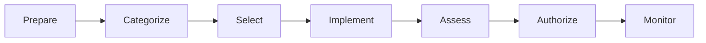

<div align="center">

# Enterprise GRC Implementation Lab

### *A Complete Enterprise Governance, Risk & Compliance (GRC) Consulting Engagement*

**Building a cloud-native Information Security Management System (ISMS) for a fictional FinTech organization using internationally recognized cybersecurity frameworks and industry best practices.**


</div>

---

# Executive Summary

This repository represents a **single end-to-end enterprise Governance, Risk & Compliance (GRC) consulting engagement** for **FinSure Technologies Pvt. Ltd.**, a fictional cloud-native FinTech organization headquartered in Bengaluru, India.

Unlike repositories containing disconnected security projects, this implementation follows the complete **NIST Risk Management Framework (RMF)** lifecycle while establishing an **Information Security Management System (ISMS)** aligned with **ISO/IEC 27001:2022**.

Every policy, assessment, risk register, vendor review, diagram, and executive report belongs to the same consulting engagement and maintains consistent business assumptions throughout the repository.

---

# Table of Contents

- [Client Overview](#client-overview)
- [Business Objectives](#business-objectives)
- [Technology Environment](#technology-environment)
- [Framework Alignment](#framework-alignment)
- [NIST RMF Lifecycle](#nist-risk-management-framework-rmf)
- [Repository Roadmap](#repository-roadmap)
- [Project Progress](#project-progress)
- [Repository Structure](#repository-structure)
- [Deliverables](#planned-deliverables)
- [Skills Demonstrated](#skills-demonstrated)
- [About This Project](#about-this-project)
- [License](#license)

---

# Client Overview

| Field | Details |
|-------|---------|
| Organization | FinSure Technologies Pvt. Ltd. |
| Industry | Cloud-native FinTech SaaS |
| Headquarters | Bengaluru, India |
| Employees | ~240 |
| Primary Customers | Small & Medium Enterprises |
| Cloud Platform | Microsoft Azure |

---

# Business Services

- Digital Payments
- Virtual Corporate Cards
- Expense Management
- Banking API Integrations
- Invoice Automation
- Financial Analytics

---

# Business Objectives

The consulting engagement aims to:

- Design and implement an Information Security Management System (ISMS)
- Reduce enterprise cyber risk
- Achieve ISO/IEC 27001 readiness
- Strengthen governance maturity
- Improve third-party risk management
- Protect customer, financial, and payment data
- Support regulatory compliance
- Establish continuous security monitoring

---

# Technology Environment

| Category | Technologies |
|-----------|--------------|
| Cloud | Microsoft Azure |
| Identity | Microsoft Entra ID, MFA, RBAC |
| Applications | React, Node.js, .NET APIs |
| Containers | Docker, Azure Kubernetes Service (AKS) |
| Databases | PostgreSQL, Azure SQL |
| DevOps | GitHub, GitHub Actions |
| Monitoring | Microsoft Sentinel, Azure Monitor |
| Collaboration | Microsoft 365, Teams, SharePoint |

---

# Framework Alignment

This implementation aligns with:

- NIST Risk Management Framework (RMF)
- NIST SP 800-30 Rev.1
- NIST SP 800-53
- ISO/IEC 27001:2022
- ISO/IEC 27002:2022
- PCI DSS
- GDPR
- India's Digital Personal Data Protection (DPDP) Act

---

# NIST Risk Management Framework (RMF)



Every project deliverable is mapped to one or more phases of the RMF lifecycle.

---

# Repository Roadmap

| Phase | Description |
|--------|-------------|
| Phase 0 | Project Foundation |
| Phase 1 | Prepare |
| Phase 2 | Categorize |
| Phase 3 | Select |
| Phase 4 | Implement |
| Phase 5 | Third-Party Risk Management |
| Phase 6 | Assess |
| Phase 7 | Authorize |
| Phase 8 | Monitor |

---

# Project Progress

| Phase | Status |
|--------|--------|
| Phase 0 – Project Foundation | 🟡 In Progress |
| Phase 1 – Prepare | ⬜ Planned |
| Phase 2 – Categorize | ⬜ Planned |
| Phase 3 – Select | ⬜ Planned |
| Phase 4 – Implement | ⬜ Planned |
| Phase 5 – Third-Party Risk Management | ⬜ Planned |
| Phase 6 – Assess | ⬜ Planned |
| Phase 7 – Authorize | ⬜ Planned |
| Phase 8 – Monitor | ⬜ Planned |

---

# Repository Structure

```text
RiskLogic-GRC/
│
├── README.md
├── docs/
│
├── diagrams/
│
├── assets/
│
├── templates/
│
├── references/
│
└── tools/
```

---

# Planned Deliverables

## Phase 0 — Project Foundation

- Engagement Charter
- Project Roadmap
- Methodology
- Assumptions Register
- Standards & Framework Mapping

## Phase 1 — Prepare

- Company Profile
- Business Context
- ISMS Scope
- Governance Structure
- Security Roles & Responsibilities
- Risk Appetite Statement

## Phase 2 — Categorize

- Asset Inventory
- Asset Classification
- Business Process Inventory
- Information Flow Analysis
- Data Flow Diagram
- Critical Business Services

## Phase 3 — Select

- Risk Assessment Methodology
- Threat Analysis
- Vulnerability Assessment
- Enterprise Risk Register
- Risk Matrix
- Risk Treatment Plan
- Statement of Applicability
- Control Selection Report

## Phase 4 — Implement

- Information Security Policy
- Access Control Policy
- Password Policy
- Incident Response Plan
- Vendor Management Policy
- Security Awareness Program
- Privacy by Design Assessment

## Phase 5 — Third-Party Risk Management

- Vendor Governance Framework
- Vendor Tiering Methodology
- Vendor Risk Assessment
- Vendor Security Questionnaire
- Residual Risk Register
- Continuous Vendor Monitoring

## Phase 6 — Assess

- Internal Audit Checklist
- Audit Findings Report
- Compliance Assessment
- Corrective Action Plan

## Phase 7 — Authorize

- Executive Security Report
- Management Review
- Residual Risk Acceptance
- Authorization Recommendation

## Phase 8 — Monitor

- Continuous Monitoring Strategy
- KPI Dashboard
- KRI Dashboard
- Business Continuity Plan
- Disaster Recovery Plan
- Lessons Learned

---

# Skills Demonstrated

### Governance

- Information Security Governance
- ISMS Design
- Security Policy Development

### Risk Management

- Enterprise Risk Assessment
- Risk Treatment Planning
- Residual Risk Analysis
- Risk Monitoring

### Compliance

- ISO/IEC 27001
- ISO/IEC 27002
- PCI DSS
- GDPR
- DPDP Act

### Third-Party Risk Management

- Vendor Tiering
- Vendor Risk Assessments
- Security Questionnaires
- Continuous Monitoring

### Executive Communication

- Security Reporting
- Compliance Documentation
- Risk Dashboards
- Management Review

---

# Repository Vision

By the completion of this project, the repository will simulate a complete enterprise GRC consulting engagement that demonstrates how governance, risk management, compliance, information security, and third-party risk management integrate within a modern cloud-native FinTech environment.

The implementation is designed to reflect realistic consulting deliverables, professional documentation standards, and enterprise security practices that are directly applicable to GRC, IT Risk, Information Security, Compliance, and Third-Party Risk Analyst roles.

---

# About This Project

Developed as a flagship enterprise **Governance, Risk & Compliance (GRC)** portfolio project demonstrating the practical implementation of internationally recognized cybersecurity, risk management, and compliance frameworks through a realistic end-to-end consulting engagement.

Every deliverable is designed to maintain consistency with the fictional organization, its technology environment, regulatory obligations, business objectives, and security assumptions.

---

# License

Licensed under the MIT License.

This repository is intended for educational, portfolio, and professional learning purposes.

The fictional organization **FinSure Technologies Pvt. Ltd.**, its employees, infrastructure, vendors, and business scenarios exist solely for simulation and educational purposes.

---

<div align="center">

**Enterprise GRC Implementation Lab**

*One Engagement • One Organization • One Enterprise Implementation*

</div>